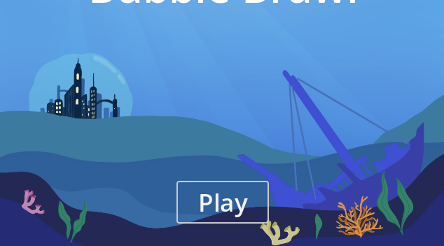

 

## About Me
I'm Seth, I like working with computer hardware and coding software. I often repurpose older computers that might otherwise go unused. I am fascinated by digital security and like to read up on current security related news.

I also enjoy programming and have worked on projects ranging from android apps to Websites. I enjoy mixing my other hobby of music with programing and creating music related apps.

 

## Languages I've coded in

Coding Languages
<ul>

</ul>
Scripting Languages
<ul>

</ul>
 

## Projects I've worked on

### [Bubble Brawl](https://ltngkarbn.itch.io/bubble-brawl)
I was part of a game jam in 2025 my team and I made a local multiplayer game in 48 hours! I worked on the menu interface for the game and collaborated closely with our composer to integrate our music into the game.  

- Card Addicts
- Music Addicts

 

## Skills and Experience

## Artifacts (put under skills?)

## Contact Me

## Links
- [Github](https://github.com/seth-palmer)
- [LinkedIn](https://www.linkedin.com/in/seth-palmer-6916b929a/)
- 

- [Icons from here](https://devicon.dev/)
