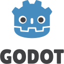

 

## About Me
I'm Seth, I like working with computer hardware and coding software. I often repurpose older computers that might otherwise go unused. I am fascinated by digital security and like to read up on current security related news.

I also enjoy programming and have worked on projects ranging from android apps to Websites. I enjoy mixing my other hobby of music with programing and creating music related apps.

 

## Languages I've coded in

Coding
<ul>

</ul>
Scripting
<ul>

</ul>
 

## Skills and Experience

### [Bubble Brawl](https://ltngkarbn.itch.io/bubble-brawl)
I was part of a game jam in 2025 my team and I made a local multiplayer game in 48 hours! 

I worked on the menu interface for the game and collaborated closely with our composer to integrate our music into the game.  The main challenge I had to overcome was learning a new language (GD Script). I really enjoyed working out how to make music dynamic with the game and I plan to work on more games in the future.

### Hippotherapy App
As part of my schooling we worked with a real industry contact on a seven month project. I was part of a group with six other developers. I worked on a range of features from a graphical data analysis to securing the app with logins. Our app also had an extensive suite of tests to ensure the functionality is maintained between releases.

I learned a lot about working with a team of developers and proper ways to test functionality. One thing I would change would be spending more time researching the technologies to use for the app, as some of what we picked later ended up making some features impossible.

- Card Addicts
- Music Addicts

## Contact Me
- [LinkedIn](https://www.linkedin.com/in/seth-palmer-6916b929a/)

## Links
- [My Github](https://github.com/seth-palmer)
- [Icons from devicon.dev](https://devicon.dev/)
