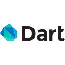

 

## About Me

    

        <h2>Hi! 👋</h2>
        

        I'm Seth, I like working with computer hardware and coding software. I often re-purpose older computers that might otherwise go unused. I am fascinated by digital security and like to read up on current security related news.
        

        

        I also enjoy programming and have worked on projects ranging from android apps to Websites. I enjoy mixing my other hobby of music with programming and creating music related apps.
        

    

    

        
    

 

## My Skills

Languages
<ul>

          

</ul>
Scripting
<ul>
Bash 
Perl 
</ul>
 
Development Tools & Platforms
<ul>

 

          
</ul>

## Experience

### [Bubble Brawl](https://ltngkarbn.itch.io/bubble-brawl)
I was part of a game jam in 2025 my team and I made a local multiplayer game in 48 hours! 

I worked on the menu interface for the game and collaborated closely with our composer to integrate our music into the game.  The main challenge I had to overcome was learning a new language (GD Script). I really enjoyed working out how to make music dynamic with the game and I plan to work on more games in the future.

### Hippotherapy App
As part of my schooling we worked with a real industry contact on a seven month project. I was part of a group with six other developers. I worked on a range of features from a graphical data analysis to securing the app with logins. Our app also had an extensive suite of tests to ensure the functionality is maintained between releases.

I learned a lot about working with a team of developers and proper ways to test functionality. One thing I would change would be spending more time researching the technologies to use for the app, as some of what we picked later ended up making some features impossible.

### Web Projects 

For a a web development class we coded websites that used both established and more recent web technologies. The projects were done in pairs and allowed us to practice working closely with a single team member. I coded two major  projects with [Douglas Riese](https://ca.linkedin.com/in/douglas-riese-51959413b), a project where all the processing is done on the web server named "Card Addicts", and a more modern component based programming model.

#### Card Addicts

#### Music Addicts

## Contact Me
    <a href="https://www.linkedin.com/in/seth-palmer-6916b929a/" target="_blank">LinkedIn</a>

## Links
- [My Github](https://github.com/seth-palmer)
- [Icons from devicon.dev](https://devicon.dev/)
